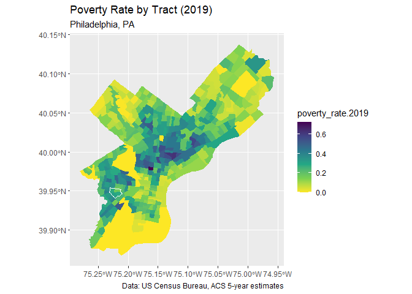

Lab2\_assignment
================
Jasmine Siyu Wu
9/8/2021

``` r
library(tidyverse)
library(tidycensus)
library(sf)
library(tmap) # mapping, install if you don't have it
set.seed(717)
```

## Load data from {tidycensus}

``` r
acs_vars <- c( "B01001_001", # ACS total Pop estimate,
               "B08201_001", # Estimate of total households
               "B08201_002", # Estimate of total households with no vehicles
               "B17001_002") # Estimate of total population whose income in the past 12 months below poverty level

myTracts <- c("42101007300", 
              "42101007800", 
              "42101007900", 
              "42101008000" )

acsTractsPHL.2019.sf <- get_acs(geography = "tract",
                             year = 2019,
                             variables = acs_vars,
                             geometry = TRUE,
                             state  = "PA",
                             county = "Philadelphia",
                             output = "wide") %>%
  dplyr::select (GEOID, NAME, all_of(paste0(acs_vars,"E"))) %>%
  rename (total_pop.2019 = B01001_001E,
          total_HH.2016 = B08201_001E,
          total_HH_no_vehicle.2019 = B08201_002E,
          total_poverty.2019 = B17001_002E) %>%
  mutate(poverty_rate.2019 = ifelse(total_pop.2019 == 0, 
                               0,
                               total_poverty.2019/total_pop.2019)) %>%
  mutate(Neighborhood = ifelse(GEOID %in% myTracts,
                               "CEDAR PARK",
                               "REST OF PHILADELPHIA"))
```

## Transform to WGS84 with {sf}

``` r
acsTractsPHL.2019.sf <- acsTractsPHL.2019.sf %>% 
  st_transform(crs = "EPSG:4326")
```

## Plot with {ggplot2}

<!-- -->
